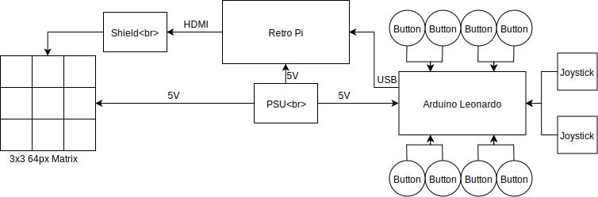

    
 
        
 
              
            <a href="https://tolvubraut.github.io/" title="Tölvubraut Tækniskólans" class="logotxt">TÖLVUBRAUT - <em>rétta leiðin</em></a>   
        

    

 

# ArcadePi

## Höfundar:
* Benedikt
* Davíð
* Kristján

## Lýsing
Þetta verkefni stefnir að því að búa til há gæða Arcade vél sem verður með nokkra sérhannaða leiki og getur emulate-að leiki frá flestum eldri leikjatölvum eins og SNES, Gameboy etc. Body-ið á vélinni mun vera búinn til í framtíðarstofunni. Þessi Arcade mun henta æðislega fyrir sýningar og atburði til þess að auglýsa Tölvubraut og framtíðarstofuna.

## Part list
#### 86,844 kr
[Power Supply * 3](https://www.meanwell-web.com/en-gb/ac-dc-single-output-enclosed-power-supply-output-rs--25--5) 
[Screen 64x64px * 9](https://www.adafruit.com/product/3649) 
[Arduino Leonardo * 3](https://store.arduino.cc/leonardo) 
[Start Button * 2](https://www.adafruit.com/product/1188) 
[C14 Male Power Socket * 3](https://www.amazon.com/URBEST-Socket-Module-Switch-Terminals/dp/B06XNMT3WL/ref=sr_1_1_sspa?keywords=C14+Inlet+Male+Plug+Power+Socket&qid=1552381915&s=gateway&sr=8-1-spons&psc=1) 
[Screen power adapter * 6](https://www.adafruit.com/product/3211) 
[Screen driver pcb * 2](https://www.adafruit.com/product/2345)

## Hversu langt komumst við?

Það komu upp mjög mörg skrautleg vandamál sem við sáum ekki fyrir í þessu verkefni, og það hægði frekar mikið á okkur. Þess vegna þurftum við að minnka verkefnið smá til að það væri hægt að ná deadline-inu.

* festum alla skjánna við 3x3 frame
* tengdum þá alla við raspberri pi kóða sem gat spilað video eða display-að myndir á pi-inn
* tengdum input takka við pi-inn sem gat interactað við skjáinn
* settum upp blueprint fyrir hvernig þetta ætti að líta út að lokum (sést að ofan)
* kynntum okkur pixel mapper kóða til þess að við gætum skrifað okkar eiginn pixel mapper kóða.
* kynntum okkur hvernig á að vinna með ffmpeg

## Hvað vantar upp á verkefnið? 

* Fá ffmpeg screen capture til að displaya á matrixið
* Búa til custom pixel mapper fyrir setup-ið okkar
* Forrita leonardo til að senda usb-signal
* Búa til kassa utan um vélina

## Kóði

Við skrifuðum mjög lítinn kóða þar sem flest allt sem við gerðum var annaðhvort testing með kóða sem var nú þegar til eða bara hardware hlutir eins og að reyna að tengja allt saman rétt.
Mest allur kóði sem við notuðum var frá þessu adafruit matrix library:
https://github.com/hzeller/rpi-rgb-led-matrix

## Myndir og myndbönd

